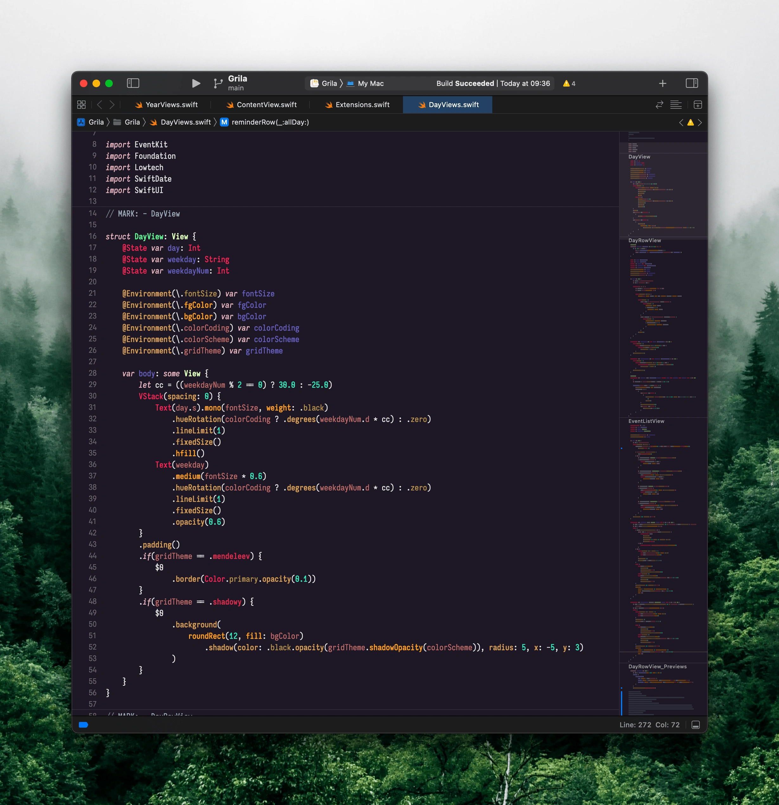

# Darkwoods - Xcode theme

This repository contains the Xcode theme that I use. Feel free to use it or modify it to your liking.



## Installation

It's as simple as running the [install.sh](./install.sh) script in this repo:

```
curl https://raw.githubusercontent.com/alin23/XcodeDarkwoodsTheme/master/install.sh | bash
```

This will install the [Iosevka Mayukai Code Pro](https://github.com/Iosevka-Mayukai/Iosevka-Mayukai) font and this Xcode theme for you.
